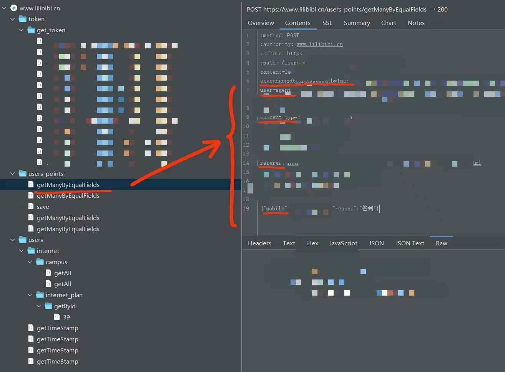

# 校猫日记自动打卡脚本

这是一个用于完成"校猫日记"微信小程序打卡的Python脚本。

## 功能特点

- 自动获取当前积分
- 自动获取服务器时间戳
- 自动完成打卡
- 每日只打卡一次的限制（可取消）
- 打卡记录保存

## 安装使用

1. 克隆项目
   ```bash
   git clone https://github.com/ZZZjiwaikill/xmrj-autocheckin.git
   cd xmrj-autocheckin
   ```
2. 使用Charles，对“我要签到”的按钮进行抓包。具体步骤如下：
   1. 根据[Charles使用教程（一）| 使用Charles抓包微信小程序](https://www.zhihu.com/tardis/bd/art/1896701961547538943)，安装软件、根证书
   2. 停止抓包，清空所有抓包记录，尽可能地关闭浏览器以确保没有任何请求在进行。
   3. 抓包：
      1. 开始抓包
      2. 点击“我要签到”按钮，抓包软件会记录下这个请求。
      3. 停止抓包
      4. 查看抓包记录，如下图找到`config.py`内待填写的信息：
3. 在 `config.py` 中，填写你的个人信息
4. 安装依赖: `pip install requests`
5. 运行脚本: `python xmrj_autocheckin.py`
6. 若命令行输出为
   ```bash
   打卡结果： {'points': {'ID': xxx, 'Mobile': xxx, 'BeforePoints': 120, 'ProcessPoints': 10, 'AfterPoints': 130, 'CreateTime': xxx, 'Reason': '签到'}}
   打卡成功，已记录
   ```
   则说明已打卡成功（`xxx`为个人隐私信息）


## 重要声明

本脚本仅用于教育和技术研究目的。请注意：

1. 请勿滥用打卡功能
2. 使用本脚本即表示您同意仅用于合法目的。
3. 脚本已内置每日一次的限制机制
4. 请勿在`config.py`文件中取消每日打卡的限制！（`ENABLE_DAILY_CHECKIN_LIMIT = False`）否则将会导致一天之内重复打卡，重复领取积分！

## 免责声明

作者不对使用此脚本可能造成的任何问题负责，请合理使用。
